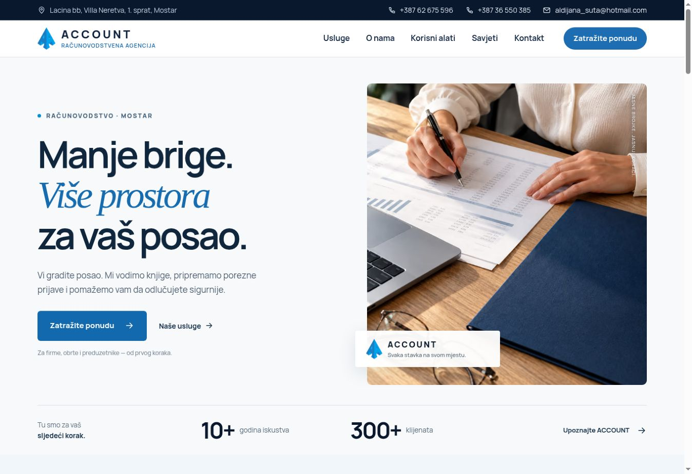
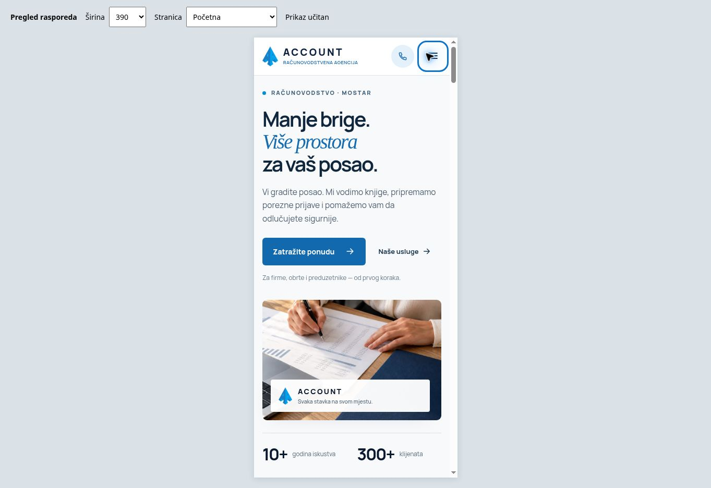

# ACCOUNT — redizajn, 24. 9. 2026.

## Izvori i odluke

- Izvorna ponuda, kontakt i četiri recenzije: https://www.agencija-account.com/ i podstranice o-nama, racunovodstvo, konzultantske-usluge, zastupanje-inostranih-poduzeca, ostale-usluge.
- The3Key: https://the3key.com/ — karakteristična tipografija i jasno istaknuta ponuda. Awwwards Honorable Mention: https://www.awwwards.com/sites/the3key. Primijenjen princip prepoznatljivosti; vizuelni identitet nije kopiran.
- Capstone, SAD: https://capstoneaccounting.com/ — jasna hijerarhija i put do usluge. Web Excellence Awards: https://we-awards.com/winner/capstone-accounting/.
- Shine, Evropa: https://shine.co/en — topliji ton finansijskog brenda, kombinacija serifne i jednostavne tipografije, konkretna korist za male firme.
- Cooper Parry, UK: https://www.cooperparry.com/ — snažan karakter i kompozicija; ekstravagantna animacija nije primjerena potrebama lokalne računovodstvene agencije.
- Fountax, UAE/UK: https://fountax.com/ — razumljiva podjela usluga i vidljiv kontakt.
- Dubai, Al Burhan case study: https://www.nascenture.com/portfolio/a-digital-experience-for-a-firm-built-on-trust/ — povjerenje, preglednost i profesionalna prezentacija usluga.

Nagrada je provjerena samo gdje je naveden izvor organizatora. Lista nije predstavljena kao objektivna rang-lista najboljih svjetskih stranica.

## Šta je promijenjeno

1. Svijetla početna sekcija, tamnoplava tipografija, serifni akcent, konkretniji poziv na kontakt i nova fotografija u neposrednoj blizini naslova.
2. Nova AI ilustrativna fotografija pregleda računovodstvene dokumentacije: bez Starog mosta, bez izmišljene panorame ili tvrdnje da prikazuje stvarni ured/tim. Originalni logo je zaseban element preko slike, bez generisanog precrtavanja.
3. Odvojeno kadriranje za male ekrane, AVIF/WebP i tri veličine; mobilna traka se pojavljuje tek nakon početne sekcije i skriva se uz obrazac.
4. Sve četiri recenzije u izvornom redoslijedu i s tačnim tekstom. Ispravka: **Alem Šunje**, ne Šunja. Originalne fotografije Adisa, Alema i Almira; Maja ima inicijal jer original koristi generičku ikonu. Nema izmišljenih zvjezdica.
5. Vraćen širi izvorni opseg savjetovanja i podrške inostranim preduzećima, registracija i projekata. Sačuvani potvrđeni 10+ godina i 300+ klijenata.
6. Svih osam tema iz izvornog FAQ-a, uz jasniji bosanski tekst. Jezički pregled navigacije, usluga, kontakta, alata, poruka validacije i članaka. Izvorne recenzije ostaju doslovne.

## Datoteke i reproducibilnost

- Nova slika: `source-images/hero-v3/account-rad.jpg`; optimizacije generiše `npm run images`.
- Izvorni portreti: `source-images/reviews/`; web-prikaz 104 × 104 piksela u `public/images/reviews/`.
- Regresijski test poredi recenzije s nezavisno izvučenim podacima originalnog HTML-a u `tests/fixtures/original-reviews.json`.
- Izvorni URL slugovi ostaju kompatibilni; javni nazivi koriste bosanske oblike.

## Provjera

- `npm run check`: 0 grešaka i upozorenja; `npm test`: 23/23; produkcijska izgradnja uspješna.
- Statička provjera: 17 stranica, 488 internih linkova; bez nepostojećih ciljeva i slika, dupliranih ID-ova ili nedostajućih alt atributa; jedan H1 i `bs-BA` na svakoj stranici.
- Vercel je uspješno objavio izmjene iz commita `8ef0e5c`.
- Pregled početne na desktopu i u prilagodljivom okviru širina 360, 390, 768, 1024 i 1280 px. Sadržaj početne nema horizontalnog prelijevanja. Okvir uključuje standardnu širinu skrolbara; ovo nije test na fizičkom iPhoneu.
- Mobilna fotografija počinje oko 500 px od vrha stranice; mobilna kontaktna traka skrivena je u heroju i vidljiva nakon njega. Meni se otvara i zatvara tipkom Escape.
- Objavljene recenzije imaju tačna imena, puni tekst i učitane originalne portrete. Maja nema izmišljenu fotografiju.
- Vodič: sva tri koraka i preporuka za pokretanje posla. Kalkulator: 2.000 KM fiksnih troškova i 40 % varijabilnih daju 3.333,33 KM praga pokrića; uz 1.000 KM željenog viška rezultat je 5.000,00 KM.
- Glavni CTA otvara `/kontakt#upit`. Prazna forma prikazuje bosanske poruke validacije. Na stvarnoj kontaktnoj stranici izbor „Telefonom“ prikazuje telefon i skriva e-mail.
- Privremeni alat za pregled različitih širina uklonjen je nakon provjere.
- Prikaz Safari/Firefox preglednika i stvarna isporuka e-maila nisu potvrđeni ovim pregledom.

## Snimci objavljene stranice

Slanje stvarnog testnog upita agenciji nije izvršeno; testovi obrasca i dostave koriste kontrolisane odgovore.
