# Redizajn ACCOUNT — izvještaj (24. 9. 2026.)

Provedba upute „ACCOUNT-Claude-Code-redizajn-prompt“. Grana: `claude/slike-za-slanje-cui34c`. Ovaj izvještaj ne daje ocjenu „10/10“; kvalitet treba procijeniti pregledom objavljene verzije.

## 1. Audit zatečenog stanja

| Oblast | Zatečeno | Problem u odnosu na uputu |
|---|---|---|
| Prvi ekran | H1 „Vi vodite posao. Mi brinemo o računovodstvu.“; inscenirana fotografija fascikle | Nije odmah jasno šta, za koga i gdje; inscenirana scena |
| Fotografije | Šest inscenirana stola s fasciklama i kalkulatorima na početnoj, uslugama i savjetima | Uputa traži izbjegavanje ponavljanih inscenirana stolova, fascikli i kalkulatora |
| Tok saradnje | Ilustrativni „Mjesečni pregled“ s animiranim stupcima | Lažni digitalni ekran; animacija veća od opacity/translate |
| Brojke | Animirano brojanje 10+ / 300+ | Animacija izvan opacity/translate |
| Efekti | Zamućenje (backdrop-filter) u zaglavlju, donjoj traci i dugmetu; lebdeći gradijentni kvadrat u CTA traci; tačkasti sjaj | Staklo i lebdeći oblici |
| Tipografija i boje | Hladne svijetloplave površine | Uputa traži toplije kamene neutralne boje i uredničku tipografiju |
| Tekst | Pojedinačne opće fraze („pouzdanu vanjsku podršku“, „Preciznost / Jasan govor / Dostupnost“) | Fraze bez konkretnog objašnjenja |

Sačuvano bez izmjena funkcije: vodič, konfigurator, kalkulator, kontakt forma (validacija, status slanja, zaštita), FAQ, savjeti, alati, URL-ovi i 301 preusmjerenja, društvene mreže, mobilni poziv, mjerenje događaja, potvrđeni podaci i recenzije.

## 2. Vizuelni smjer (provedeno)

- **Boje:** tamnoplava (`#0F2340`, tamni zid `#0E1420`) i plava iz izvornog znaka (`#187CC4`, `#00A0EC`) uz tople kamene površine (`#F3EEE6`, linije `#DDD3C3`).
- **Tipografija:** jedno pismo (Manrope), veći i zbijeniji naslovi (H1 do 64 px, H2 do 48 px), numerisane liste, tanke linije umjesto kartica.
- **Vlastiti detalj iz znaka:** mali trokut s tamnijom lijevom i svjetlijom desnom polovinom (kao na znaku) u oznakama sekcija; isti trokut gradi ravne motive usluga (`src/components/ServiceMotif.astro`).
- **Uklonjeno:** stakleni efekti, lebdeći oblici, lažni ekran, 3D nagib, animirano brojanje. Animacije su samo diskretno pojavljivanje (opacity + translate) i isključene su uz `prefers-reduced-motion`.

## 3. Sadržajne izmjene

- H1: „Računovodstvo za firme i obrte u Mostaru.“ Podnaslov: „Poslovne knjige, porezne obaveze i savjetovanje uz jasan dogovor i dostupnu podršku.“ Pozivi: „Zatražite ponudu“, „Pregledajte usluge“. U prvom ekranu: 10+ godina iskustva, 300+ klijenata, Lacina bb, Villa Neretva, Mostar.
- Dosadašnji slogan „Vi vodite posao. Mi brinemo o računovodstvu.“ premješten je u završni kontakt blok.
- Početna, redom: hero → pet usluga (numerisana lista, konkretan opis, jedan link) → za koga → dokaz (10+, 300+, ovlašteno zastupanje, recenzije s dosadašnjeg weba) → saradnja u tri koraka → vodič „Koja vam usluga treba?“ → savjeti → FAQ i kontakt.
- Stranice usluga i pregled usluga: vlastiti ravni motiv umjesto inscenirane fotografije.
- Savjeti: urednička lista bez fotografija; članci bez naslovne fotografije.
- O nama: „Do čega nam je stalo“ zamijenjeno konkretnim „Kako izgleda saradnja“ (dogovor prije početka, dostava e-mailom, direktan kontakt s brojevima telefona).
- Usluga računovodstva: „Firme koje žele pouzdanu vanjsku računovodstvenu podršku“ → „Firme kojima treba vanjsko vođenje knjiga, izvještaja i prijava“; „u svakom trenutku znate gdje vaše poslovanje stoji“ → „imate jasan pregled svog poslovanja“.
- Kalkulator: dodane „Pretpostavke izračuna“ i napomena da je izračun ilustrativan i nije porezni ni računovodstveni savjet.
- Podnožje: „Naslovna fotografija je konceptualna i ne prikazuje prostor agencije.“
- Pravopis: pregledan sav vidljivi tekst (navigacija, usluge, FAQ, članci, alati, forma i poruke, alt tekstovi, title/meta, 404, politika privatnosti, mobilni meni). Novi naslov koristi „preduzetnici“ (ne „poduzetnici“). URL slug `/zastupanje-inostranih-poduzeca` je izvorni i zadržan.

## 4. Funkcionalnost — izvještaj

| Funkcija | Stanje | Kako je provjereno |
|---|---|---|
| Navigacija, mobilni meni (preko cijelog ekrana, Escape) | radi | test u pregledniku |
| CTA „Zatražite ponudu“ → `/kontakt#upit`; „Pregledajte usluge“ → `#usluge` | radi | pregled i test |
| Vodič (3 koraka, povratak čuva odabir, preporuka, link na formu s uslugom) | radi | test u pregledniku |
| Konfigurator (sažetak bez cijene, prenos u formu preko sessionStorage) | radi | test u pregledniku |
| Kalkulator (3.333,33 KM; 5.000,00 KM; V=0; F=0; V≥100 %; decimalni zarez; reset) | radi | jedinični testovi i test u pregledniku |
| Kontakt forma: validacija, jedan zahtjev pri dvostrukom slanju, uspjeh tek nakon prihvata, pri grešci unos ostaje i nudi se telefon | radi | test u pregledniku, lažni pružalac (bez stvarnih e-mailova) |
| Server: honeypot, prebrzo slanje, tuđe porijeklo 403, validacija 422, bez JS-a 303, 429 nakon 5 upita | radi | direktni HTTP testovi |
| Mobilna donja traka ne prekriva formu i sadržaj | radi | test u pregledniku |
| Instagram/Facebook linkovi, `tel:` i `mailto:` | radi | pregled |

## 5. Provjere

- `npm run check`: 0 grešaka, 0 upozorenja.
- `npm test`: 22/22.
- `npm run build`: uspješan.
- Testovi u pregledniku (`tests/e2e/alati-i-forma.mjs`): 56/56; slanje s lažnim pružaocem (`tests/e2e/slanje-upita.mjs`): 18/18.
- Pregled 15 stranica na 360, 390, 768, 1024, 1280 i 1440 px (`tests/e2e/pregled-stranica.mjs`): bez horizontalnog skrola i grešaka u konzoli, jedan H1 po stranici, sve slike s alt tekstom, sva polja s labelom.
- Vizuelni pregled heroja na 360, 390, 768, 1024, 1280 i 1440 px, stranica usluga, savjeta i cijele početne (desktop i mobitel).
- Lighthouse (laboratorijski, simulirani mobitel): početna 98 / 100 / 100 (performanse / pristupačnost / najbolje prakse), LCP 2,3 s, CLS 0; `/racunovodstvo` 99 / 100 / 100, LCP 1,8 s. Laboratorijsko mjerenje nije dokaz rezultata na stvarnim posjetama.

## 6. Snimci prije i poslije

| | Prije | Poslije |
|---|---|---|
| Početna, desktop, prvi ekran | 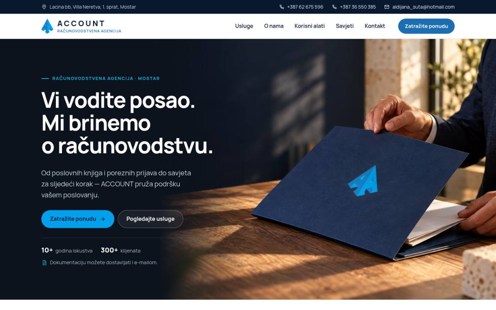 | 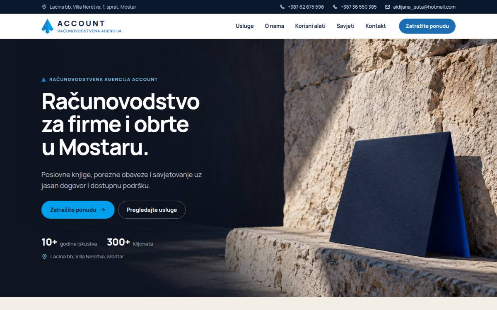 |
| Početna, mobitel, prvi ekran |  | 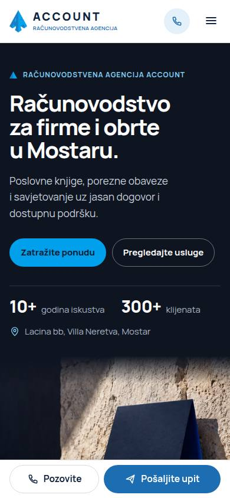 |
| Početna, desktop, cijela | 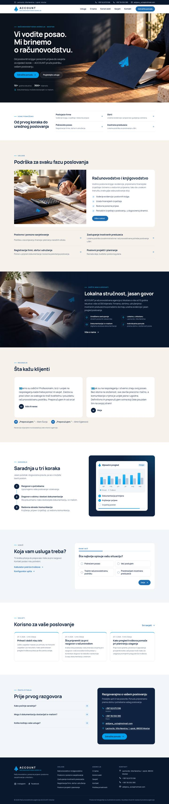 | 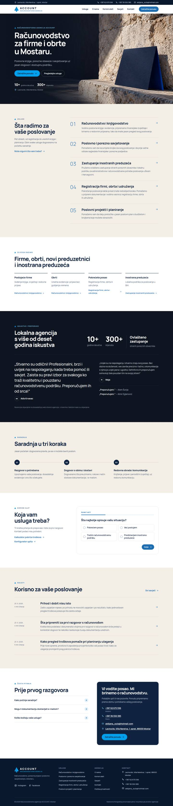 |
| Početna, mobitel, cijela | 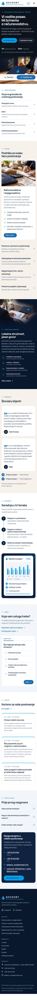 | 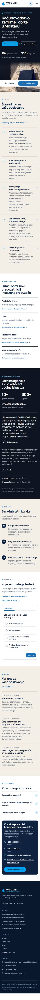 |
| Računovodstvo, desktop | 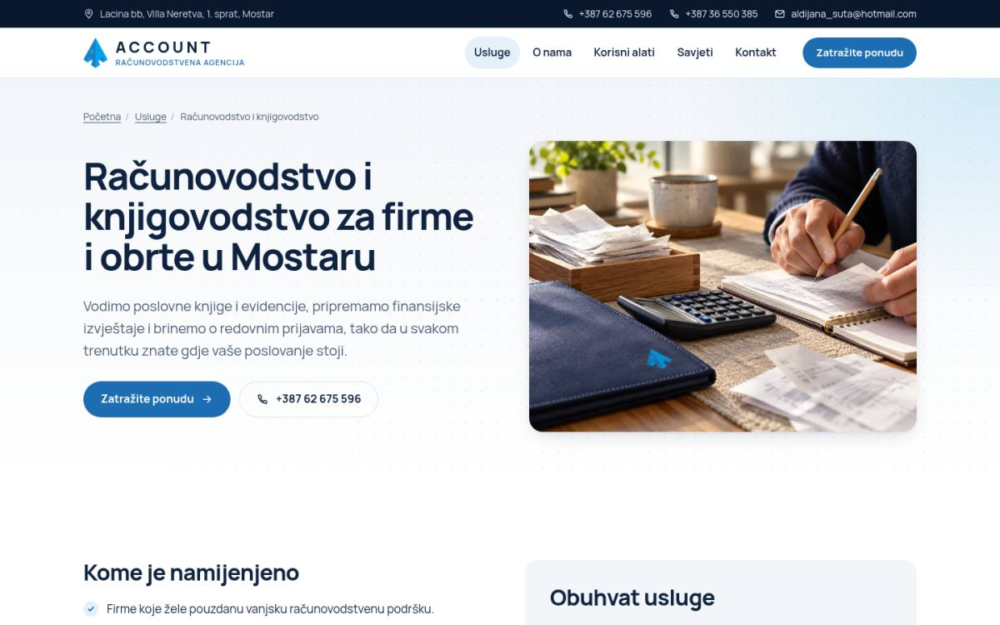 | 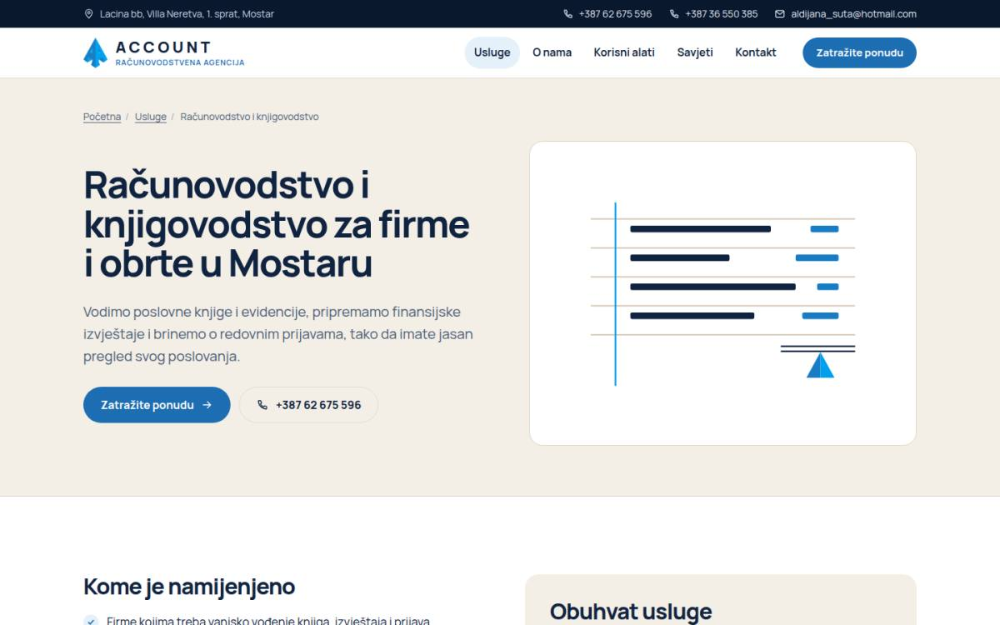 |
| Računovodstvo, mobitel | 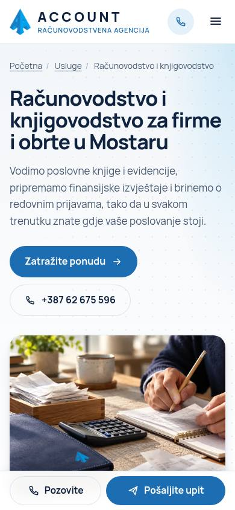 | 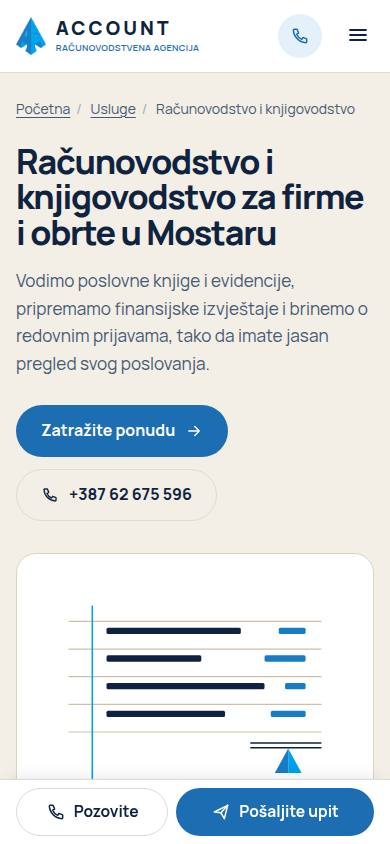 |

## 7. Poznata ograničenja

- Stvarna isporuka e-maila s forme nije verifikovana: nedostaju Resend ključ, verifikovani pošiljalac i potvrđen primalac. Bez njih forma jasno kaže da slanje nije dostupno i nudi telefon.
- Tekst recenzija preuzet je iz indeksa pretraživača (stara stranica nije dostupna iz razvojnog okruženja); prije produkcije uporediti sa živom stranicom.
- Referentne stranice iz upute nisu otvorene direktno (mrežna politika okruženja); primijenjeni su principi opisani u uputi.
- Demo je zaštićen od indeksiranja (`PUBLIC_ALLOW_INDEXING`); za produkciju ukloniti zaštitu i uskladiti domenu.
- Testirano u Chromiumu; Safari i Firefox nisu testirani u ovom okruženju.
